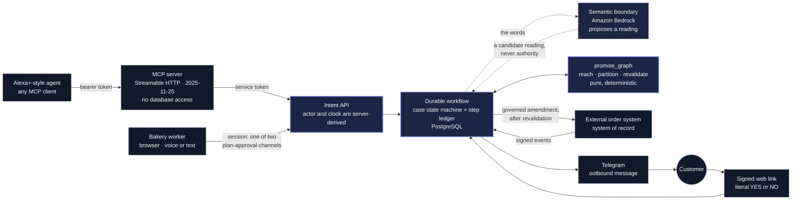

<p align="center">
  <picture>
    <source media="(prefers-color-scheme: dark)" srcset="brand/promisepatch-icon-on-dark.svg">
    
  </picture>
</p>

<h1 align="center">PromisePatch</h1>

<p align="center">
  <b>The model understands. The deterministic protocol authorizes.</b><br>
  When a missed delivery breaks promises already made, PromisePatch changes only what it is allowed
  to change: a swap the customer already agreed to, or one they approve now. The rest goes to the
  owner, and every order the failure does not reach is left untouched.
</p>

<p align="center">
  
</p>

<p align="center">
  <a href="https://184.194.40.87.sslip.io"></a>
  <a href="#60-second-judge-path"></a>
  <a href="#proof-index"></a>
  <a href="https://github.com/Asembris/PromisePatch/actions/runs/36310794944"></a>
</p>

<p align="center">
  <a href="https://github.com/Asembris/PromisePatch/actions/workflows/pr.yml"></a>
  <a href="docs/p5.1-mcp-transport-spine.md"></a>
  <a href="docs/adr/0007-runtime-semantic-model-nova-2-lite.md"></a>
  <a href="docs/p6.2-first-deployment.md"></a>
  
  <a href="LICENSE"></a>
</p>

> **0 of 2 untouched orders received an incident-caused effect, in each of five deployed restart
> rehearsals** of the canonical case, while the four threatened orders were recovered or escalated.
> Measured on the frozen deployment, counted per effect type:
> [the demo funnel](docs/g8-demo-funnel.md).

## 60-second judge path

1. **The problem**: [why a missed delivery is a promise problem, not an inventory problem](#the-problem).
2. **The scenario**: [one failed raspberry delivery, six orders, four lanes](#the-canonical-scenario),
   or open the [live app](https://184.194.40.87.sslip.io) and press *Look around a real case*
   (read-only, no account).
3. **The authority model**: [who may change what, and what the model is never allowed to do](#how-authority-works).
4. **The measured results**: [three numbers, each with its caveat](#measured-evidence).
5. **The architecture**: [one diagram showing where the model stops](#architecture).
6. **The proof**: [the proof index](#proof-index) links every claim to its committed record.

## The problem

A made-to-order bakery accepts promises against supply it expects to receive. Then, one morning,
the raspberries do not arrive.

Replanning the inventory is the easy part. The hard part is the promises already made: which
customer orders does this failure actually reach? Which may be changed under a substitution the
customer already agreed to, which need the customer to say yes, which must go to the owner
because no permitted recovery exists, and which must not be touched at all? A frontline worker
has to answer that in the middle of a shift. A language model can help understand what they
said, but it must never be the thing that decides.

## What PromisePatch does

| | step | who decides |
|---|---|---|
| 1 | A worker reports the failure by voice or text: *"today's raspberry delivery didn't arrive."* | the worker attests the physical fact; over MCP, the server's configured worker does |
| 2 | PromisePatch understands the report and asks one clarifying question if needed. | deterministic lexicon first; a model only for phrasing it cannot read |
| 3 | It finds every accepted customer promise the failure reaches. | the deterministic engine |
| 4 | It puts each promise in exactly one authority lane: **AUTO**, **ASK**, **BLOCKED** or **UNAFFECTED**. | recorded constraints and pre-authored recipe versions |
| 5 | A worker confirms the plan that was read out, bound to that plan's identity. | a human, in a signed-in browser session or on the operator console |
| 6 | Pre-authorized changes run; the owner gets the blocked ones, with scheduled work held. | the protocol |
| 7 | A customer who must agree gets one message and answers on a signed web link. | the customer, with a literal `YES` or `NO` |
| 8 | Before the change may be committed, ten checks run against a **fresh** snapshot. | the protocol |
| 9 | The change is written to the external order system as a governed amendment. | the order system stays the system of record |

Promises the failure does not reach get no message, no write, no reservation change, no task hold
and no audit event.

## The canonical scenario

The Hollow Oak bakery fixture: six accepted orders, one missing raspberry delivery. The worker
clarifies *"just raspberries - the strawberries came."* This case was provisioned, restored and
run five times on the deployed release candidate
([funnel](docs/g8-demo-funnel.md), [case definition](docs/seeded-demo-case.md)).

| order | lane | why | settled outcome |
|---|---|---|---|
| A | **AUTO** | a substitution the customer's recorded preference already allows | amended in the order system, v1 → v2 |
| B | **ASK** | a substitution the customer must approve | one Telegram message; `YES` on the signed link; revalidated; amended v1 → v2 |
| C | **BLOCKED** | the customer's constraint forbids substitution | escalated to the owner; scheduled work held |
| D | **BLOCKED** | no pre-authored recipe version exists | escalated to the owner; scheduled work held |
| E | **UNAFFECTED** | no raspberries in it | untouched: 0 effects |
| F | **UNAFFECTED** | no raspberries in it | untouched: 0 effects |

The customers, recipes and order system are labelled fixtures and a simulator. The Telegram
message and the web approval are real.

## Measured evidence

Three numbers, as the roadmap requires them to be reported. Each has a caveat, and the caveat is
part of the result.

| result | what it is | read this first |
|---|---|---|
| **11/16** | The **permanent headline**. The first scored run of sixteen frozen effect-set scenarios against the v1 manifest, which was hand-labelled before the runner existed. Five failed, and the result is never replaced. | [effect-set-first-scored-run.md](docs/effect-set-first-scored-run.md) |
| **16/16** | A **separate** release condition, not a re-score of v1. It was run once against **v2**, a separately versioned label correction in which one label moved: S12's hold, because started kitchen work is never held ([ADR-0017](docs/adr/0017-a-blocked-promise-does-not-hold-a-started-task.md)). The code was product-identical to the deployed release candidate. The other four v1 failures were implementation defects, fixed under published SHAs. | [g8-effect-set-release-condition.md](docs/g8-effect-set-release-condition.md) |
| **0/2** | Untouched orders that received an incident-caused effect, in each of **five** deployed rehearsals. Each one restarted the worker at a different point: while waiting for the customer, across the plan confirmation, across the answer, after resolution, and the first again. Per rehearsal: 2 amendments, 1 customer message, 2 task holds, 3 outbox rows, all delivered on attempt 1. | [g8-demo-funnel.md](docs/g8-demo-funnel.md) |
| **9/10** | Voice turns in which a truthful spoken response began within four seconds of speech ending. The gate was 9, so it passed by one turn. | [g7-ten-turn-voice-measurement.md](docs/g7-ten-turn-voice-measurement.md) |

What those numbers do **not** say:

- The effect sets are **developer-authored, finite and public**. They are not an independent or
  held-out benchmark. The effect-set CI workflow stays red on purpose, because it judges v1.
- The funnel is **one fixture measured five times**. It shows the demo repeats, not a reliability
  rate.
- The voice result comes from a **second run**. The first run (`K = 1/10`) was voided after its
  intervals had been computed, which the predeclared protocol forbids, and the
  [claims audit](docs/claims-audit.md) says a strict reader may treat run 2 as a best-of-two. Both
  runs are published in full. They ran on the local stack, with no public-internet round trip,
  using the browser's own speech APIs.

The release itself: `pr` run
[`36310794944`](https://github.com/Asembris/PromisePatch/actions/runs/36310794944) passed 13 of 13
jobs on the exact release SHA, the whole-stack browser job among them.

## How authority works

**The model understands; the deterministic protocol authorizes.** Every rule below is enforced in
code and tests, not by convention. Import-linter contracts forbid the model boundary, the MCP
server and the conversational client from reaching the domain or the database.

- **Model output is never authority.** The semantic model proposes interpretations only: a
  reading of a sentence that must ground in the bakery's own vocabulary. It cannot write a row,
  record consent, approve a plan or choose a recovery, and a fact it helps read is recorded as the
  reporting worker's, never the model's. The canonical raspberry report costs **zero** model
  calls, and a test asserts it.
- **Worker plan approval and customer consent are different things**, with different parsers,
  records and words. A customer's yes never spends a worker approval, and the reverse is also
  true.
- **Customer consent is a literal `YES` or `NO`**, trimmed and case-insensitive. Any other reply
  decides nothing: it is stored verbatim and earns one confirmation prompt.
- **A service credential is not a person.** Holding the MCP bearer token proves a process. MCP
  intake is therefore a trusted reporting channel: a report it carries is attested under the
  intent API's configured surface worker (`PP_SURFACE_WORKER_ID`), not by a person the server
  authenticated. The actor and the clock are always server-derived, and an MCP `confirm` can only
  spend an approval a human already wrote, in a signed-in browser session or on the operator
  console ([ADR-0018](docs/adr/0018-a-plan-confirmation-spends-a-human-approval.md)).
- **A confirmation binds to the plan that was read out.** Stale, wrong-case, replayed and repeated
  confirmations fail closed.
- **A yes is perishable.** When a customer's answer arrives, ten checks run against a fresh
  snapshot before the change may be committed. A change that is no longer true is refused as
  `STALE`, nothing is sent, and that track is re-planned; an expired answer is escalated to the
  owner and an unauthorized one is refused. The ten checks guard the commit: the commit re-judges
  the plan's fingerprint and production start
  ([ADR-0024](docs/adr/0024-freshness-is-judged-where-the-effect-is-committed.md)), and after it
  only the production start is judged again, at the amendment's first dispatch
  ([ADR-0026](docs/adr/0026-a-first-dispatch-that-provably-sends-nothing-is-judged-again.md)).
  A stale finding at either point escalates to the owner rather than re-planning.
- **Recovery only selects pre-authored recipe versions.** Nothing invents a substitute at runtime.
- **Unknown or conflicting state fails closed to `BLOCKED`**, never to `UNAFFECTED`.
- **Started work is never reported as stopped.** Scheduled work on a blocked promise is held;
  work that has already started is escalated to its owner instead.
- **A withdrawal is never an undo.** It stops future work and reverses no physical fact.

More detail: [semantic-boundary.md](docs/semantic-boundary.md),
[mcp-human-confirmation-boundary.md](docs/mcp-human-confirmation-boundary.md),
[started-work-contract.md](docs/started-work-contract.md),
[bounded-withdrawal.md](docs/bounded-withdrawal.md) and the ADRs in [`docs/adr/`](docs/adr/).

## Architecture



Solid indigo borders mark where authority lives. The dashed node is understanding only.

- **`promise_graph`** ([`packages/promise-graph`](packages/promise-graph)) is a pure package.
  It handles reachability, temporal availability, allocation, impact classification, recovery
  validation, snapshot fingerprints and the revalidation checklist. It does no I/O, reads no
  environment and never calls the clock, so every customer-affecting decision can be tested
  without the cloud.
- **The backend** ([`apps/backend`](apps/backend)) runs as `api`, `worker` and `mcp`: a persisted
  case state machine with a step ledger and an audited PostgreSQL write boundary. The worker is
  stateless: restarting it is the recovery mechanism, and outstanding work resumes from its rows.
- **The external order system** ([`apps/order-simulator`](apps/order-simulator)) is a separate
  application with its own store. PromisePatch mirrors it and pushes governed amendments; neither
  reads the other's storage ([order-system.md](docs/order-system.md)).
- **The case workspace** ([`apps/frontend`](apps/frontend)) renders the case and never decides.

## Alexa+ and MCP

PromisePatch exposes its five intent tools (**report, clarify, confirm, withdraw, status**) over
an authenticated MCP endpoint: Streamable HTTP, protocol revision **`2025-11-25`**, pinned with a
test. That endpoint is what an Alexa+ agent, or any other MCP client, would call. Unauthenticated
callers are refused before the protocol layer, and unlisted `Origin` and `Host` values are
rejected.

**This is not a native Alexa+ integration**, and none is claimed. The Alexa+ experience is
simulated by MCP clients that call the real endpoint: the repository's own conversational client
(`pp converse`) and the official SDK client in the protocol suite. In the browser, voice uses the
browser's own speech recognition and synthesis and reaches the same application services as a
typed turn. No spoken phrase carries authority that a typed one could not.

See [p5.1-mcp-transport-spine.md](docs/p5.1-mcp-transport-spine.md) (transport),
[p5.2-mcp-clarification-and-confirmation.md](docs/p5.2-mcp-clarification-and-confirmation.md)
(tool contract) and [p5.3-conversational-orchestrator.md](docs/p5.3-conversational-orchestrator.md)
(the client, which holds no authority).

## AWS deployment

The app is live at **<https://184.194.40.87.sslip.io>**. It runs on one EC2 `t4g.small` in
`us-east-1` behind Caddy with a Let's Encrypt certificate, against a private, encrypted RDS
PostgreSQL. IMDSv2 is required, and the instance role calls Amazon Bedrock; no AWS key is held
anywhere. It serves the case workspace, the API, the event stream and the MCP endpoint.

| | |
|---|---|
| frozen deployed product/image SHA | `4529a802e34e`, reported by `GET /healthz` |
| frozen repository release SHA | `56c302366b3ddc0d824c1588a4a9ddbd193ed891` |
| relationship | two different commits whose deployable product paths are tree-identical ([g8-closeout.md](docs/g8-closeout.md) §3) |
| customer channel | Telegram outbound is live; one message was delivered per rehearsal. Customers answer through the signed web link ([deployed-customer-channel.md](docs/deployed-customer-channel.md)) |
| feature freeze | declared 2026-09-27; any later change to a product path voids it |

How it got there: [p6.2-first-deployment.md](docs/p6.2-first-deployment.md),
[phase7-rc-deployment.md](docs/phase7-rc-deployment.md),
[phase7-approval-log-privacy-repair.md](docs/phase7-approval-log-privacy-repair.md) (the image
that runs now) and [customer-disclosure-hardening.md](docs/customer-disclosure-hardening.md).

## Judge demo and reproduction

**On the live app.** Press *Look around a real case*. It opens a read-only observer session with
no account. You can read everything, including the evidence drawer, and change nothing, because
the domain refuses every write from that principal
([ADR-0016](docs/adr/0016-a-judge-principal-stays-read-only.md)).

**From a clone, with nothing but Python and uv.** These need no database, no container and no
credential:

```bash
uv run python scripts/verify_effect_set_manifest.py   # recompute the frozen v1 manifest hash
uv run python scripts/run_effect_sets.py --check      # prove the clone is complete and intact
uv run pytest packages/promise-graph                  # the deterministic engine's own suite
```

The engine also runs standalone, outside the workspace. See
[`packages/promise-graph/README.md`](packages/promise-graph/README.md) and its
[fresh-clone proof](docs/g8-standalone-fresh-clone-proof.md).

**The whole storyboard, locally.** Bring up the [local stack](#run-the-local-stack), then run the
demo-contract runner. It executes the canonical storyboard as 49 assertions through the product's
own transports, and reads its evidence in read-only transactions. The fixture and the worker
restart stay the operator's actions
([g8-demo-contract-runner.md](docs/g8-demo-contract-runner.md)):

```bash
PP_INTERNAL_SERVICE_TOKEN="$(grep '^PP_INTERNAL_SERVICE_TOKEN=' docker/env/api.env | cut -d= -f2-)" \
  uv run python scripts/with_local_env.py -- \
  uv run python scripts/demo_contract.py --api http://127.0.0.1:58000 --order-system http://127.0.0.1:58100
```

## Proof index

| claim | record | what it proves |
|---|---|---|
| release proof, closed | [g8-closeout.md](docs/g8-closeout.md) | 22 of 22 G8 rows closed, the two SHAs reconciled, and the feature freeze |
| exact release SHA passes CI | [`pr` run 36310794944](https://github.com/Asembris/PromisePatch/actions/runs/36310794944) | 13 of 13 jobs on `56c3023`, the whole-stack browser job included |
| restart-safe on the deployment | [R1](docs/g8-rehearsal-r1.md) · [R2](docs/g8-rehearsal-r2.md) · [R3](docs/g8-rehearsal-r3.md) · [R4](docs/g8-rehearsal-r4.md) · [R5](docs/g8-rehearsal-r5.md) | five worker restarts at four points on `4529a802e34e`, each PASS, every effect recorded once and delivered on attempt 1 |
| untouched means untouched | [g8-demo-funnel.md](docs/g8-demo-funnel.md) | the funnel 6 → 1/1/2 + 2, and 0/2 untouched orders affected, in all five rehearsals |
| the storyboard is executable | [g8-demo-contract-runner.md](docs/g8-demo-contract-runner.md) | 49 assertions through the intent API and the signed link, with no direct consent insert |
| the immutable headline | [effect-set-first-scored-run.md](docs/effect-set-first-scored-run.md) | 11/16 against frozen v1, with every diff published |
| the separate release condition | [g8-effect-set-release-condition.md](docs/g8-effect-set-release-condition.md) | 16/16 against the v2 label correction, and the fix SHA for each v1 failure |
| adversarial faults | [g8-adversarial-proof-map.md](docs/g8-adversarial-proof-map.md) | all eleven named faults, from a lost MCP response and model self-confirmation to crashes on either side of external acceptance, each proved |
| the voice number | [g7-ten-turn-voice-measurement.md](docs/g7-ten-turn-voice-measurement.md) | 9/10 in run 2, with void run 1 and every timing published |
| MCP transport | [p5.1-mcp-transport-spine.md](docs/p5.1-mcp-transport-spine.md) | Streamable HTTP, `2025-11-25`, bearer and `Origin`/`Host` refusals, tested with the official SDK |
| real customer loop | [deployed-customer-channel.md](docs/deployed-customer-channel.md) · [customer-approval-link.md](docs/customer-approval-link.md) | one Telegram delivery and a web `YES`, revalidated, then `EXT-B` amended once |
| the deployment | [p6.2-first-deployment.md](docs/p6.2-first-deployment.md) · [phase7-approval-log-privacy-repair.md](docs/phase7-approval-log-privacy-repair.md) | the AWS stack, and the image that runs now |
| engine from a clean clone | [g8-standalone-fresh-clone-proof.md](docs/g8-standalone-fresh-clone-proof.md) | 335 tests passed from a fresh public clone |
| effect-set clone check | [g8-effect-set-fresh-clone-proof.md](docs/g8-effect-set-fresh-clone-proof.md) | `uv sync --frozen` and both manifests' checks exit `0` |
| development evidence | [g8-development-evidence.md](docs/g8-development-evidence.md) | curated, redacted evaluation results, failures kept |
| provenance | [g8-contribution-provenance.md](docs/g8-contribution-provenance.md) | every commit is dated inside the submission window |
| claims against evidence | [claims-audit.md](docs/claims-audit.md) | an audit of this repository's own claims, overclaims included |
| integration cost | [prerequisites-integration-cost-and-limitations.md](docs/prerequisites-integration-cost-and-limitations.md) | what adopting this would require, and what is not established |

## Honest limitations

- **One bakery, fixture data, a simulated order system.** It is not Square or a production point
  of sale. The Telegram message and the web approval are the real parts.
- **No refusal path has been exercised live.** `STALE`, `EXPIRED`, `UNAUTHORIZED` and `NOOP` are
  proved by tests only.
- **Telegram inbound is deliberately not built.** A second route for the word `YES` would be a
  second consent parser. The signed link proves possession of the message, not identity.
- **Telegram's Bot API has no idempotency key.** A retry after an uncertain send can deliver a
  duplicate message. Order amendments carry a stable idempotency key, so a duplicate is a second
  message, never a second amendment ([customer-message-transport.md](docs/customer-message-transport.md)).
- **MCP intake is a trusted reporting channel.** A report over MCP is attested as the server's
  configured worker, not by a person the server authenticated
  ([p5.1-mcp-transport-spine.md](docs/p5.1-mcp-transport-spine.md)).
- **The effect sets are developer-authored**, and both evaluation holdouts remain sealed.
- **The `SUR-1` comparative benchmark says nothing comparative about models.** Two of its arms
  called the model zero times ([sur1-fifth-scored-run.md](docs/sur1-fifth-scored-run.md)).
- **The voice result carries the caveats above**, and it is not a production latency SLA.
- **Operations debt is recorded, not fixed.** `deploy.sh stack` cannot release against the drifted
  stack template ([non-destructive-release.md](docs/non-destructive-release.md) §10.1). The demo
  restore needs settings no single deployed container holds
  ([demo-world-restore.md](docs/demo-world-restore.md)). CloudWatch keeps pre-redaction lines
  until its 14-day retention expires them.
- **Deployment smoke shows 9/12 from the operator's machine.** A local TLS-intercepting proxy
  times out three refusal probes; on the host they answer `401`, `403` and `421`.
- **G7's demo-narrative comprehension check was not performed**, by the project owner's decision.

---

## Development

### Prerequisites

- Python 3.12 and [uv](https://docs.astral.sh/uv/)
- Docker with Compose v2, for the local stack
- Node.js 24, for the frontend

### Run the local stack

The stack is a disposable PostgreSQL 16 in a Docker volume, the repository's own migrations,
the Hollow Oak fixture, the API, the durable workflow worker, the MCP endpoint, the frontend
and the External Order System simulator. It needs no hosted database and no cloud account.

```bash
uv run python scripts/bootstrap_local_env.py
```

That generates `docker/env/*.env` with fresh credentials. The files are never committed, and
there are no default passwords: read the seeded demo logins out of `docker/env/migrate.env`.

```bash
docker compose up --detach --wait
```

`--wait` returns only once PostgreSQL is healthy, the migrations have exited zero, the fixture
has loaded, `/readyz` reports ready and the frontend is serving. Then open
<http://localhost:55173> and sign in as `maya` with `PP_DEMO_WORKER_PASSWORD`.

```bash
docker compose run --rm seed        # reload the fixture
docker compose restart worker       # restart the worker; outstanding work resumes
docker compose down                 # stop, keeping the database
docker compose down --volumes       # stop and discard the database
```

| Service | On the host | Inside the network |
|---|---|---|
| frontend | <http://localhost:55173> | `frontend:5173` |
| api | <http://localhost:58000> | `api:8000` |
| worker | no port; `docker compose logs worker` | -- |
| mcp | <http://localhost:58001/mcp> | `mcp:8001` |
| order-simulator | <http://localhost:58100> | `order-simulator:8100` |
| postgres | `127.0.0.1:55432` | `postgres:5432` |

The host ports are deliberately not 5173, 8000 and 5432: those are usually already taken on a
machine that develops this project. If a port is reserved on your machine, override it with the
`PROMISEPATCH_*_PUBLISHED_PORT` variables.

A few properties are worth knowing before you use it:

- **Neither the API nor the worker holds an administrative credential.** Both connect as
  `promisepatch_app`, which owns nothing, migrates nothing and cannot truncate a table.
  Migrations and `pp reset-demo-state` run in separate containers with the administrative
  connection. That is why there is no HTTP reset endpoint.
- **The worker is stateless, so restarting it is the recovery mechanism.** Every piece of
  outstanding work is a row and everything the process holds is a lease; `docker compose
  restart worker` -- or killing it outright -- loses nothing, and the work resumes as the
  leases expire. Several workers can run at once without coordinating.
- **`pp reset-demo-state` recreates the fixture workers, so it signs everyone out.** It is an
  operator command that replaces every domain row PromisePatch owns, and the sessions go with
  them.
- **`pp restore-demo-world` is the whole demo repair, and it is destructive.** It reseeds, resets
  the External Order System's own order book, opens the canonical case, and puts back a demo
  customer binding the reset would otherwise erase. It requires `--confirm destroy-and-restore`,
  refuses anything that is not a canonical demo world before it destroys anything, and never
  confirms a plan or sends a message. `--dry-run` writes nothing. See
  [docs/demo-world-restore.md](docs/demo-world-restore.md).
- **The MCP endpoint is a separate process, and cannot reach the database.** It reaches a case
  the way any other client would: an authenticated HTTP call to the API's `/internal/intents`.
  Point a client at it with the bearer token from `docker/env/mcp.env`.
- **The customer channel defaults to a fake provider** everywhere except the deployment, so CI,
  the tests and the local stack send nothing. Telegram is selected by
  `PP_CUSTOMER_CHANNEL_PROVIDER=telegram`
  ([customer-message-transport.md](docs/customer-message-transport.md)).
- **The model defaults to a deterministic fake**, so the suites, the local stack and CI run with
  no AWS credentials of any kind. `PP_LLM_PROVIDER=bedrock` switches to Amazon Bedrock using
  whatever the AWS SDK already authenticates with.

Behind an antivirus or corporate proxy that terminates TLS, put that root certificate in
`docker/env/extra-ca.crt` before building; the file is created empty and is otherwise ignored.

### Choosing a database for the repository tooling

`.env` at the repository root points Alembic, the CLI and the integration suite at whichever
database you configured. `docker/env/host.env` points them at the disposable local one instead,
and `scripts/with_local_env.py` runs a single command with it:

```bash
uv run python scripts/with_local_env.py -- uv run pytest apps/backend
```

### Tests

`pr` is the product gate: ruff, mypy in three groups, pytest with a coverage floor, the
Hypothesis CI profile, import-linter, the MCP protocol suite, the semantic boundary and
evaluation, the order system, the frontend, gitleaks, the backend against PostgreSQL and the
whole-stack browser suite.

The engine suite needs nothing at all:

```bash
uv run pytest packages/promise-graph
```

The backend suite needs a database. With the local stack running, **stop the worker first**: it
shares the local database and will claim the steps a workflow test just enqueued.

```bash
docker compose stop worker
```

```bash
uv run python scripts/with_local_env.py -- uv run pytest apps/backend
```

The order-system boundary, end to end across both applications:

```bash
uv run python scripts/with_local_env.py -- uv run pytest apps/backend/tests/test_order_system_boundary.py
```

The semantic boundary needs neither a database nor an AWS account:

```bash
uv run pytest apps/backend/tests/test_semantic_contracts.py \
  apps/backend/tests/test_semantic_provider.py \
  apps/backend/tests/test_semantic_grounding.py \
  apps/backend/tests/test_explanations.py \
  apps/backend/tests/test_bedrock_semantic.py
```

The MCP protocol suite needs no database, no credential and no model. It starts the real server
on a loopback socket and drives it with the official SDK's client:

```bash
uv run pytest apps/backend/tests/test_mcp_protocol.py apps/backend/tests/test_status_view.py \
  apps/backend/tests/test_plan_identity.py
```

What a tool call *causes* needs the database. This suite drives SDK client, Streamable HTTP, MCP
server, the service-token hop, the intent API, the domain and PostgreSQL, then asserts the rows:

```bash
uv run python scripts/with_local_env.py -- uv run pytest apps/backend/tests/test_intent_api.py
```

Tests that call Amazon Bedrock for real are marked `bedrock_live` and deselected by default:

```bash
PP_LLM_PROVIDER=bedrock uv run pytest -m bedrock_live
```

The order system's own suite:

```bash
uv run pytest apps/order-simulator packages/order-contract
```

The effect-set harness runs the frozen scenarios against the real system. With the local stack
up and the worker stopped, this is a development run that computes no score; `--scored`
reproduces the measurement, and `--manifest` selects v2
([effect-set-run-protocol.md](docs/effect-set-run-protocol.md) fixes what counts as scored):

```bash
uv run python scripts/with_local_env.py -- uv run python scripts/run_effect_sets.py
```

```bash
uv run pytest apps/backend/tests/test_effect_set_judge.py scripts/tests/test_run_effect_sets.py \
  scripts/tests/test_effect_set_manifest.py
```

The frozen v1 manifest is `docs/effect-sets/scenarios.v1.json`, `promisepatch-effect-sets`
v1.0.0, content hash `d41f5afcd01eda8e6fa4c28784f1fb0c238bbc27711019aac670914db62b2cdc`. Its
labels are not derived from PromisePatch's output ([effect-set-manifest.md](docs/effect-set-manifest.md)).

The semantic and explanation evaluations run offline with zero provider calls:
`python -m evals replay` and `python -m evals explanation-replay`
([evals/README.md](evals/README.md), [explanation-quality-gate.md](docs/explanation-quality-gate.md)).

The frontend gates, and the browser suite against the local stack (it reloads the fixture):

```bash
cd apps/frontend && npm ci && npm run typecheck && npm run lint && npm test && npm run build
```

```bash
cd apps/frontend && npx playwright install chromium && npm run e2e
```

## License

Apache-2.0. See [LICENSE](LICENSE).

The feature freeze is in force from repository release SHA `56c3023`. Only submission, evidence
and documentation corrections land after it.
